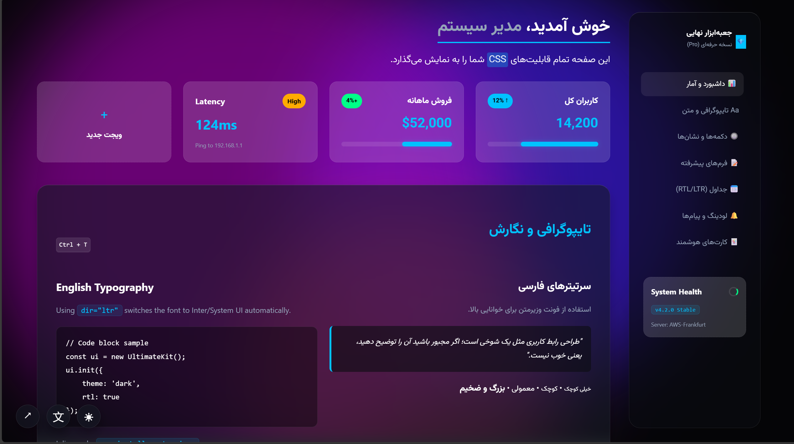
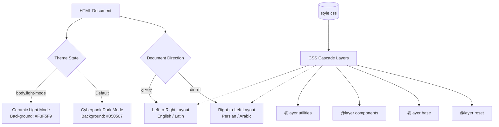

<!-- REPLACE: If you have a custom logo, replace the capsule-render URL with your raw image link -->
<div align="center">
  


  

  <br><br>

  <!-- GitHub SEO: Badges with descriptive alt text for search indexing -->
  <a href="https://github.com/amir-hossein-khodaei/signature-css-framework/releases">
    
  </a>
  <a href="https://cdn.jsdelivr.net/gh/amir-hossein-khodaei/signature-css-framework@0.11/style.css">
    
  </a>
  <a href="https://github.com/amir-hossein-khodaei/signature-css-framework/blob/main/LICENSE">
    
  </a>
  
  

  <br><br>

  <!-- Action Buttons -->
  <a href="https://amkhodaei83.github.io/signature-css-framework/">
    
  </a>
  <a href="https://github.com/amir-hossein-khodaei/signature-css-framework/issues">
    
  </a>

  <br><br>
  
  <p>
    <b>The ultimate vanilla CSS UI toolkit.</b><br>
    Build high-performance, accessible, and stunningly modern web applications without the bloat of JavaScript frameworks.
  </p>
</div>

<hr>

## Table of Contents

<details>
<summary><strong>Expand to view full navigation</strong></summary>

1. [Hero](#signature-theme)
2. [Table of Contents](#table-of-contents)
3. [About The Project](#about-the-project)
4. [Demo & Visuals](#demo--visuals)
5. [Getting Started](#getting-started)
6. [Usage](#usage)
7. [API Reference](#api-reference)
8. [Roadmap](#roadmap)
9. [Contributing](#contributing)
10. [License](#license)
11. [Contact & Acknowledgments](#contact--acknowledgments)

</details>

<hr>

## About The Project

Modern web development is often plagued by heavy JavaScript bundles, massive utility-class stylesheets, and complex build steps. **Signature Theme** is a meticulously crafted, zero-dependency vanilla CSS UI framework designed to solve this exact problem. It provides developers and designers with a complete, production-ready design system that operates entirely in the browser, relying purely on the power of modern CSS3 and semantic HTML5.

Whether you are building an administrative dashboard, a SaaS landing page, or a data-heavy application, this CSS UI toolkit delivers a premium aesthetic out of the box. It features a unique **Glassmorphism** design language, offering two distinct visual experiences: the neon-infused **"Cyberpunk Glass"** dark mode, and the ultra-clean **"Ceramic"** light mode. 

Crucially, Signature Theme is engineered for global accessibility, featuring native, automatic **Bi-Directional (RTL/LTR) support**. By leveraging advanced CSS logical properties (like `inset-inline-end` and `padding-inline-start`), the entire layout seamlessly flips between English (Left-to-Right) and Persian/Arabic (Right-to-Left) layouts instantly, driven purely by the document's `dir` attribute.

### Key Features

* **🎨 Pure CSS Glassmorphism:** Implements cutting-edge `backdrop-filter` rendering, dynamic CSS variable theming, and multi-layered box shadows for depth without the rendering cost of WebGL.
* **🌐 Native RTL & LTR Architecture:** Built from the ground up with logical CSS properties. Switch from an English (`dir="ltr"`) layout to a Persian (`dir="rtl"`) layout instantly. No duplicate stylesheets required.
* **⚡ Zero Build-Step Dependency:** No Webpack, Vite, Node.js, or NPM required. Drop the `<link>` tag into your HTML document and start building immediately.
* **🧩 Smart Component System:** Utilizes the modern CSS `:has()` pseudo-class to create context-aware components (e.g., cards that automatically adjust their internal grid layout if they detect an image).
* **📱 Responsive Layouts:** A robust, fluid grid system and highly adaptive sidebar navigation that elegantly collapses into an off-canvas mobile menu on smaller screens.
* **✨ Native Micro-Interactions:** Includes CSS-only accordion menus (`<details>`/`<summary>`), animated SVG background orbs, and skeletal loading states.

### Tech Stack

This framework strictly adheres to web standards, ensuring maximum compatibility and minimum overhead:

*  **Modern CSS3:** Leveraging `@layer` cascades, CSS Custom Properties (`:root`), Grid/Flexbox layouts, and advanced selectors (`:has`, `:focus-visible`).
*  **Semantic HTML5:** Deep utilization of native web elements like `<progress>`, `<dialog>` (via custom modals), and semantic structuring (`<main>`, `<aside>`, `<section>`).
*  **Vanilla JavaScript:** An ultra-lightweight (under 2KB) scripting layer exclusively for triggering theme toggles, modal states, and ephemeral toast notifications.


## Demo & Visuals

Experience the framework in real-time. The live showcase demonstrates all components, layout shifts, and thematic changes without any page reloads.

**[🌐 View Live Interactive Demo](https://amkhodaei83.github.io/signature-css-framework/)**

<div align="center">
  <!-- REPLACE: path/to/your/preview-gif-or-image.gif -->
  
  <p><i>Real-time component rendering, skeletal loading states, and dynamic backdrop-filters.</i></p>
</div>

### Architectural Data Flow

Unlike traditional CSS frameworks that bloat the DOM with utility classes, Signature Theme utilizes modern CSS `@layer` directives and logical properties to maintain a clean, semantic document structure. 



<hr>

## Getting Started

Because Signature Theme is a zero-dependency architecture, you do not need Webpack, NPM, or complex build pipelines. You can integrate the entire UI system into any project in under 60 seconds.

### Prerequisites
* A standard `index.html` file.
* (Optional) Basic knowledge of JavaScript if you wish to use the built-in toast notifications and modals.

### Installation via CDN

The fastest way to deploy the framework is via the jsDelivr CDN. This serves the minified, globally cached CSS directly to your users.

Insert the following `<link>` tags into the `<head>` of your HTML document:

```html
<!-- 1. Vazirmatn Font (Required for Persian typography) -->
<link href="https://cdn.jsdelivr.net/gh/rastikerdar/vazirmatn@v33.0.3/misc/Farsi-Digits/font-face.css" rel="stylesheet" type="text/css">

<!-- 2. Signature Theme Core CSS (Latest Release: v0.11) -->
<link href="https://cdn.jsdelivr.net/gh/amir-hossein-khodaei/signature-css-framework@0.11/style.css" rel="stylesheet" type="text/css">
```

### Core Configuration Variables

While there are no shell environment variables, the theme is highly customizable via CSS Custom Properties (`:root`). You can override these in your own stylesheet to instantly rebrand the entire application.

| CSS Variable | Default Dark (Cyberpunk) | Default Light (Ceramic) | Purpose |
|:---|:---|:---|:---|
| `--primary` | `#00C2FF` | `#0066FF` | Main brand color for buttons, badges, and focus rings. |
| `--bg-body` | `#050507` | `#F3F5F9` | The absolute background color beneath the glass elements. |
| `--bg-glass` | `rgba(20, 25, 35, 0.6)` | `rgba(255, 255, 255, 0.85)` | Base background for cards, modals, and the sidebar. |
| `--border` | `rgba(255, 255, 255, 0.1)` | `rgba(0, 0, 0, 0.08)` | Universal border color for structural separation. |
| `--radius` | `24px` | `24px` | Global border-radius for large container elements. |

<hr>

## Usage

Signature Theme relies on semantic HTML and a minimal set of predictable class names. Below are the foundational patterns required to build a layout.

### 1. Document Initialization (Bi-Directional Support)

The framework listens to the `dir` attribute on the `<html>` tag to automatically align elements, reverse margins, and switch fonts (from Vazirmatn for Persian to Inter/System UI for English).

**For Persian/Arabic (RTL):**

```html
<html lang="fa" dir="rtl">
<!-- The framework will automatically push sidebars to the right and align text right -->
```
**For English/Latin (LTR):**
```html
<html lang="en" dir="ltr">
<!-- The framework will auto-swap the sidebar to the left and apply Inter font -->
```
### 2. The Smart Card Component

Signature Theme uses the modern CSS `:has()` pseudo-class to create intelligent, context-aware components. For instance, if you add an `` inside a `.card`, the CSS automatically alters the internal layout into a dual-column grid without requiring extra modifier classes.

```html
<!-- Standard Text Card -->
<div class="card">
    <span class="badge badge-info">Standard</span>
    <h4>Revenue Overview</h4>
    <p>This card uses the default vertical flex layout.</p>
</div>

<!-- Smart Image Card (Auto-detects the image and switches to Grid) -->
<div class="card">
    
    <div class="d-flex flex-column justify-center">
        <h4>Image Detected</h4>
        <p>The CSS :has(img) selector triggered a layout shift automatically!</p>
    </div>
</div>
```

### 3. Activating the Theme Toggle (Light/Dark Mode)

Dark mode is the default state. To trigger the "Ceramic" Light Mode, simply toggle the `.light-mode` class on the `<body>` element. All CSS variables will instantly cascade to their new values.

```html
<!-- HTML Button -->
<button class="btn btn-outline" onclick="toggleTheme()">Toggle Theme</button>

<!-- Vanilla JS Logic -->
<script>
function toggleTheme() {
    document.body.classList.toggle('light-mode');
}
</script>
```


## License

Distributed under the MIT License. See `LICENSE` for more information. 

By utilizing the MIT License, Signature Theme ensures that you can freely use, modify, and distribute this framework in both personal and commercial, production-grade applications without restriction, provided the original copyright notice is retained.

<hr>

## Contact & Acknowledgments

### Maintainer

**AMIR HOSSEIN KHODAEI**
* **GitHub:** [@amir-hossein-khodaei](https://github.com/amir-hossein-khodaei)
* **Email:** [amkhossein@gmail.com](mailto:amkhossein@gmail.com)

If you have questions, run into issues, or want to discuss structural improvements to the framework, the best way to reach out is by [opening an issue](https://github.com/amir-hossein-khodaei/signature-css-framework/issues) on this repository.

### Project Link
[https://github.com/amir-hossein-khodaei/signature-css-framework](https://github.com/amir-hossein-khodaei/signature-css-framework)

### Acknowledgments

This framework was built on the shoulders of modern web standards and open-source typography. Special thanks to:

* **[Vazirmatn Font](https://github.com/rastikerdar/vazirmatn):** An exceptional, highly legible Persian/Arabic typeface by Saber Rastikerdar, which powers the RTL typography of this framework.
* **[Inter Font](https://rsms.me/inter/):** The default System UI/Latin fallback utilized when the framework detects `dir="ltr"`.
* **[jsDelivr](https://www.jsdelivr.com/):** For providing the fast, reliable CDN infrastructure that makes zero-dependency deployment possible.
* **[Shields.io](https://shields.io/):** For the dynamic SVG metadata badges used throughout the repository.

<div align="center">
  <br>
  <p><i>If you found this framework helpful, please consider giving it a ⭐ on GitHub!</i></p>
  <br>
</div>
<div align="center">
  
</div>

